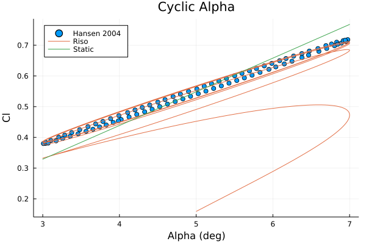

# Getting Started 

The dynamic stall models are implemented in three ways: as a functional, an iterative, and in an indicial form. 

Functional implementations create a struct that returns the state rates. This allows for easy solution using DifferentialEquations.jl. These functional implementations are designed to be passed a single set of parameters, $p$. Out of this set of parameters, several are functions, such as the freestream velocity. 

Iterative implementations create a struct that returns the state rates as well, however they are not as easily solved by DifferentialEquations.jl. The input parameters are now all constant values, including the freestream velocity and angle of attack. This implementation is designed to be solved iteratively, meaning that for a given set of parameters, the states are updated for a single time step. The purpose of this type of implementation is for interfacing with other packages, specifically Rotors.jl. In the future, a function will be introduced that converts functions that describe environmental inputs into parameters, and then iterates through the solution of the model. 

The final implementation is an indicial formulation. Rather than providing a state space model to be solve, the model takes the environmental inputs and time step and calculates the states at the next time step. Several of the dynamic stall models included in this pakage were first developed in indicial form. 


We'll get started by using a functional implementation of the Risø model. Because we are using a functional implementation, we willl need our flow conditions as functions of time.
We'll simulate a flat plate pitching in steady inflow. We'll look at a freestream velocity of 1 m/s, while the airfoil pitches plus or minus 1 degree (amplitude of 2) about 5 degrees. 

```julia
k = 0.2 #reduced frequency
u = 1.0 #freestream velocity (m/s) 
c = 1.0 #Chord (m)
amplitude = 2
shift = 5

omega = k*2*u/c #Rate of oscillation

### Prepare inputs
U(t) = u #Freestream velocity as a function of time
Udot(t) = 0.0 #Derivative of freestream velocity as a function of time
alpha(t) = (amplitude*sin(omega*t) + shift)*(pi/180) #Angle of attack as a function of time (radians)
alphadot(t) = (amplitude*omega*cos(omega*t)*(pi/180)) #Pitching rate as a function of time (radians)
```

At this point, we would normally read in an airfoil polar, however, since we are simulating a flat plate, we will use the inviscid solution for lift for a flat plate. 

```julia

aoa = -pi:0.01:pi #Angle of Attack, (radians)
lift = 2*pi.*(aoa) #Coefficient of lift
drag = zero(aoa) #Coefficient of drag, left zero for this demonstration. 
polar = hcat(aoa, lift, drag)

A = [0.165, 0.335] #From the Hansen 2004 paper, for flat plate
b = [0.0455, 0.3000] # "" ""

Tp = 3.0 # "" "" 
Tf = 6.0 # "" "" 
T = [Tp, Tf]
```

Now at this point, we'll store that information in an airfoil struct. 

```julia
using DynamicStallModels

airfoils = Array{Airfoil, 1}(undef, 1)
airfoils[1] = airfoil(polar; A, b, T)
```

If we had more airfoils, we would simply add them to the airfoils array. 

Now we'll create the Risø struct, which will be our ODE to solve. 

```julia
dsmodel = Riso(airfoils; detype=Functional())
```

And now we prepare to solve using DifferentialEquations.jl. Note the order of $p$ below, this is the required order. If simulating more than one airfoil, the chord lengths would be concatonated. So `p = vcat([U, Udot, alpha, alphadot], [c])`.

```julia
using DifferentialEquations
x0 = zeros(4) #Hansen 2004's suggest initial conditions.
x0[3] = 1.0

p = [U, Udot, alpha, alphadot, c]

tspan = (0.0, 80.0)

prob = ODEProblem(dsmodel, x0, tspan, p)
```

Now let's solve using DifferentialEquations. A function to parse the DifferentialEquations solution and calculate the coefficients of lift and drag has been provided. 


```julia
sol = solve(prob, dtmax=0.1)

Cl, Cd, t =  parsesolution(dsmodel, sol, p)
```

Also if the user has a specific set of states they would like to analyze, they can extract the states on their own and use the provided functions to calculate the coefficients. 

```julia
### Unpack
x = Array(sol)'
t = sol.t

nt = length(t)

clvec = zeros(nt, dsmodel.n)
cdvec = zeros(nt, dsmodel.n)
### run through the time steps and calculate the dynamic lift and drag (based on the states)
for i = 1:nt
    ti = t[i]
    for j = 1:dsmodel.n
        clvec[i,j], cdvec[i,j] = riso_coefficients(x[i,:], U(ti), alpha(ti), alphadot(ti), cvec[j], dsmodel.airfoils[j])
    end
end
```


Here we use Plots.jl to visualize the lift and compare against the values given in Hansen's 2004 paper where the model was presented. Note that shown is Hansen's indicial solution, whereas here we solve the state space model, so minor differences exist. 

```julia
using Plots
alphavec = alpha.(sol.t)

expdata = readdlm("./data/Hansen2004/figure8_flatplate/indicial.csv", ',')


clplt = plot(legend=:topleft, title="Cyclic Alpha", yaxis="Cl", xaxis="Alpha (deg)")
scatter!(expdata[:,1], expdata[:,2], lab="Hansen 2004")
plot!(alphavec.*(180/pi), Cl, lab="DSM - Riso")
plot!(alphavec.*(180/pi), linearlift.(alphavec), lab="Static")
display(clplt)
```



